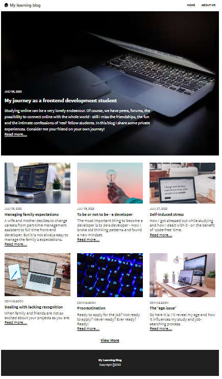

#learning-blog  
project during scrimba's frontend developer career path

note to my future self: the passing of the variable "selectedBlog" is done with localStorage
button 'read more' identifies blog using the data attribute  

